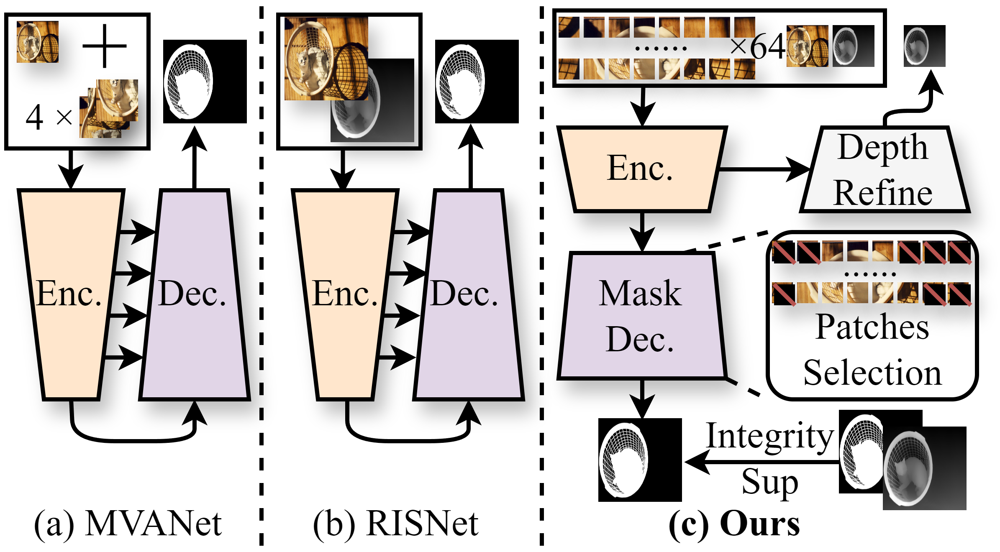
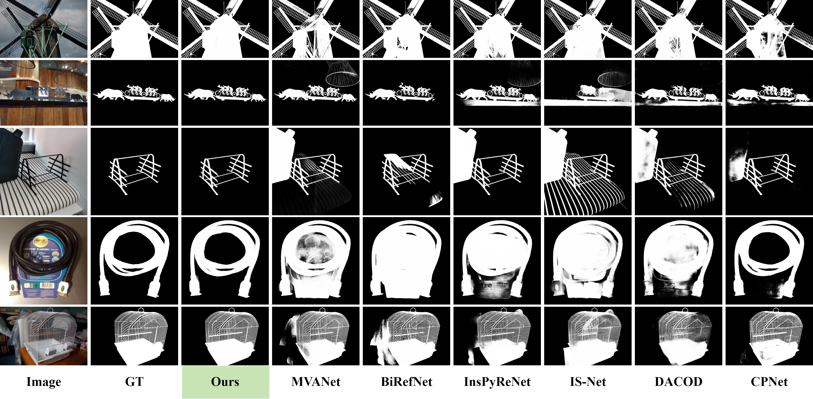

# PDFNet

This is the official PyTorch implementation of [PDFNet](https://arxiv.org/abs/2503.06100).
<div align='center'>
<a href='https://arxiv.org/abs/2503.06100'></a>&ensp;
<a href='https://huggingface.co/spaces/Tennineee/PDFNet'></a>&ensp;
</div>

> # High-Precision Dichotomous Image Segmentation via Depth Integrity-Prior and Fine-Grained Patch Strategy
>
> Xianjie Liu, Keren Fu, Qijun Zhao
>
> 😍2025/10/23: [set-soft (Salvador E. Tropea)](https://github.com/set-soft) helped to create a [ComfyUI](https://github.com/set-soft/ComfyUI-RemoveBackground_SET?tab=readme-ov-file#comparison). Now you can use PDFNet easily. Many thanks!
> 
> 💻2025/3/27: We add a Hugging Face Space using CPU. You can give it a try, and each attempt will take approximately 1 minute!
> 
> 🤖2025/3/23: We add a Demo jupyter notebook and you can easily use it to try!
> 
> 🔥2025/3/13: We released the code and checkpoints on GitHub.
> 
> 📕2025/3/10: We released the paper on the ArXiv.

🔥If you are interested in **Dichotomous Image Segmentation** (DIS), we highly recommend checking out our additional project [Awesome Dichotomous Image Segmentation](https://github.com/Tennine2077/Awesome-Dichotomous-Image-Segmentation/tree/main). This project compiles all significant research and resources related to DIS, providing comprehensive references and inspiration for your research and practice. We hope this resource list will help you better understand and apply DIS techniques, driving more accurate image segmentation tasks.

# Abstract

High-precision dichotomous image segmentation (DIS) is a task of extracting fine-grained objects from high-resolution images. Existing methods face a dilemma: non-diffusion methods work efficiently but suffer from false or missed detections due to weak semantics and less robust spatial priors; diffusion methods, using strong generative priors, have high accuracy but encounter high computational burdens. As a solution, we find pseudo depth information from monocular depth estimation models can provide essential semantic understanding that quickly reveals spatial differences across target objects and backgrounds. Inspired by this phenomenon, we discover a novel insight we term the depth integrity-prior: in pseudo depth maps, foreground objects consistently convey stable depth values with much lower variances than chaotic background patterns. To exploit such a prior, we propose a Prior of Depth Fusion Network (PDFNet). Specifically, our network establishes multimodal interactive modeling to achieve depth-guided structural perception by deeply fusing RGB and pseudo depth features. We further introduce a novel depth integrity-prior loss to explicitly enforce depth consistency in segmentation results. Additionally, we design a fine-grained perception enhancement module with adaptive patch selection to perform boundary-sensitive detail refinement. Notably, PDFNet achieves state-of-the-art performance with only 94M parameters (<11% of those diffusion-based models), outperforming all non-diffusion methods and surpassing some diffusion methods.


## Installation
```
conda create -n PDFNet python = 3.11.4
conda activate PDFNet

pip install -r requirements.txt
```
## Dataset Preparation

Please download the [DIS-5K dataset](https://github.com/xuebinqin/DIS) first and place them in the "**data**" directory. The structure of the "**data**" folder should be as follows:
```
PDFNet
└──DATA
	└──DIS-DATA
	    └── DIS-TE1
	    ├── DIS-TE2
	    ├── DIS-TE3
	    ├── DIS-TE4
	    ├── DIS-TR
	    └── DIS-VD
	    	├──images
	    	└──masks
```
Download [Swin-B weights](https://github.com/SwinTransformer/storage/releases/download/v1.0.0/swin_base_patch4_window12_384_22k.pth)  into '**checkpoints**'.

### Depth Preparation
Please download the [DAM-V2 Project](https://github.com/DepthAnything/Depth-Anything-V2) and place them into the DAM-V2 and download the [DAM-V2 weights](https://github.com/DepthAnything/Depth-Anything-V2) into the '**checkpoints**'.
Now you can use the '**DAM-V2/Depth-preprare.ipynb**' to generate the pseudo-depth map for training and testing.

# Training

Run
```
python Train_PDFNet.py
```
If you wanna change the training datasets, you can open the '**dataoloaders/Mydataset.py**' '**build_dataset**' function to add the other datasets.

# Test and metric

Open the '**metric_tools/Test**'  to change the '**save_dir**' and open the '**soc_metric**' to change the '**gt_roots**' and '**cycle_roots**' to what you need.
Run
```
cd metric_tools
python Test.py
```

# Different training datasets results and checkpoints

| Training Dataset       | Checkpoints and Validation Results                                                                                        |
| ---------------------- | ------------------------------------------------------------------------------------------------------------------------- |
| DIS-5K TR              | [DIS Checkpoint and visual results](https://drive.google.com/drive/folders/1dqkFVR4TElSRFNHhu6er45OQkoHhJsZz?usp=sharing) |
| HRSOD -TR + UHRSD - TR | [Only Visual results](https://drive.google.com/file/d/1DKL1Jonx_PR1HF6m0D4lyUQtAmR7oQrd/view?usp=sharing)                 |

You also can use the '**demo.ipynb**' to try PDFNet easily!
# Compare
## Visual results

# BibTeX

Please consider to cite PDFNet if it helps your research.
```
@misc{liu2025highprecisiondichotomousimagesegmentation,
      title={High-Precision Dichotomous Image Segmentation via Depth Integrity-Prior and Fine-Grained Patch Strategy}, 
      author={Xianjie Liu and Keren Fu and Qijun Zhao},
      year={2025},
      eprint={2503.06100},
      archivePrefix={arXiv},
      primaryClass={cs.CV},
      url={https://arxiv.org/abs/2503.06100}, 
}
```
